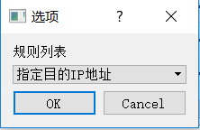
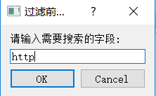
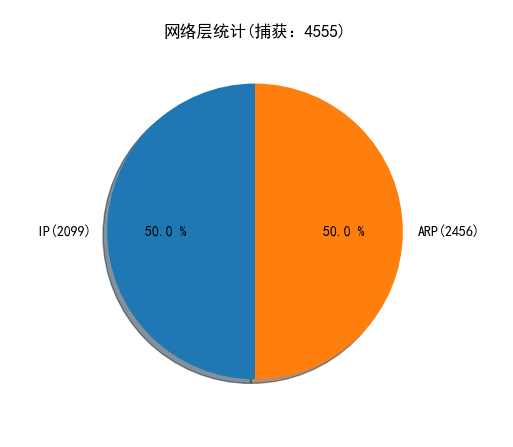
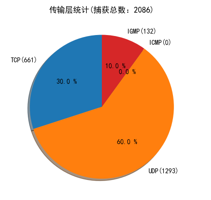
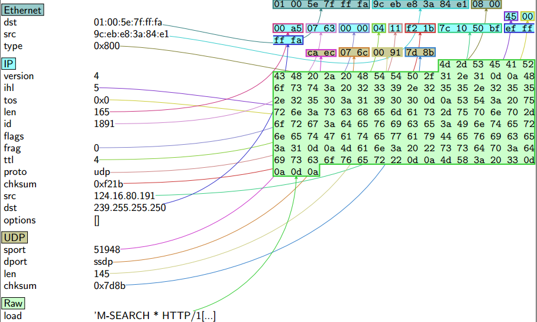

# sniffer

基于pyqt5，scapy的嗅探器

### 依赖

- npcap
- python3
- pyqt5
- scapy
- scapy_http
- numpy
- matplotlib
- TeXLive或者LaTex

### 嗅探器具有功能

- 网卡的选择
- 捕获流经网卡的数据包
- 支持Ethernet,IP,ARP,TCP,UDP,ICMP,IGMP,HTTP协议的解析
- 支持捕获前过滤和捕获后过滤
- 支持将捕获的数据包保存为pcap文件
- 支持将单个数据包保存为图片的pdf文件
- 支持根据协议分析进行着色
- 支持实时显示捕获数据包数量和显示数量
- 支持捕获数据包统计图分析

### 部分功能效果

抓包

捕获过滤

显示过滤

捕获统计图分析

右键点击单个数据包保存为pdf图片

